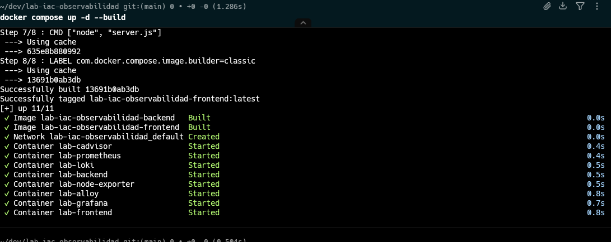
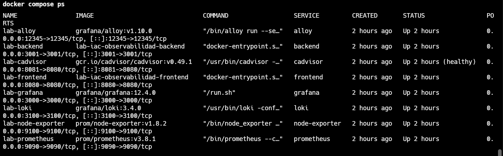
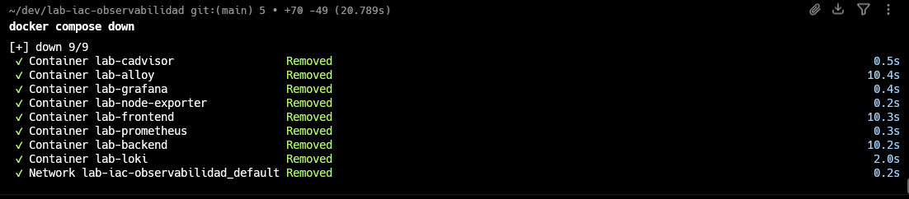
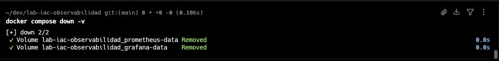

# INtrucciones para validar

## Levantar contenedores

```
docker compose up -d --build
```



## Servicios principales

| Servicio   | URL                           |
| ---------- | ----------------------------- |
| Frontend   | http://localhost:8080         |
| Backend    | http://localhost:3001/metrics |
| Grafana    | http://localhost:3000         |
| Prometheus | http://localhost:9090         |

## Ver contenedores en ejecución

```
docker compose ps
```



## Detener los contenedores (conservando los dashboards)

```
docker compose down
```



## Detener los contenedores (borrando todo)

```
docker compose down -v
```


